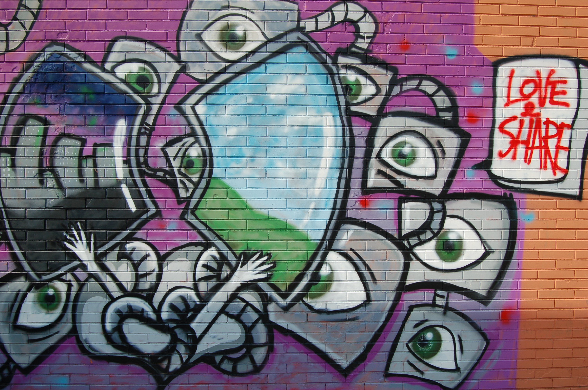

# R-For-Data-Science

## Description
This course provides a rigorous introduction to the R programming language, with a  particular focus on using R in a data science setting. Whether you are part of a data science team or working individually within a community of developers, this course will give you the knowledge of R needed to make useful contributions in those settings. As the first course in the Specialization, the course provides the essential foundation of R needed for the following courses. We cover basic R concepts and language fundamentals, key concepts like tidy data and related "tidyverse" tools, processing and manipulation of complex and large datasets, handling textual data, and basic data science tasks. Upon completing this course, learners will have fluency at the R console and will be able to create tidy datasets from a wide range of possible data sources.

It is offered by faculty members in the Johns Hopkins Department of Biostatistics, Johns Hopkins Bloomberg School of Public Health. There are currently 12 courses that are offered in the Data Science Curriculum.

## Curriculum

### Introduction to Chromebook Data Science
This is the first class in the Chromebook Data Science series. Data science is one of the most exciting and fastest growing careers in the world. The goal of this series is to help people with no background and limited resources transition into data science. The only pre-requisites are a computer with a web browser and the ability to type and follow instructions. We guide you through the rest.

### How to Use A Chromebook
This course will introduce you to using a Chromebook. The Introduction and Setup course might sound simple, but it will set up the infrastructure for success with the later, more challenging courses.

### Google and the Cloud
The Google and the Cloud course introduces using Google’s in-built apps, which form the fundamental backbone of a Chromebook. We’ll go step by step through the process to integrating these apps together to form your productivity workflow.

### Organizing Data Science Projects
Projects are central to the role of any data scientist. These lessons will discuss how to organize projects and the files that are part of each project and will introduce you to Markdown, a simple way to compile text documents to a standard format.

### Version Control
Github is the world’s most popular version control website. With GitHub and Markdown, they provide a powerful way for you to get your code out to the world. In this course, we will tour GitHub, discussing the basic features of the website, what a repository is, and how to work with repositories on GitHub.

### Introduction to R
R is a simple to learn programming language that is powerful for data analysis. The R Basics course will teach you how to get started from ground zero. We will discuss what objects and packages are, introduce some basic R commands, and discuss RMarkdown, which you will use to write all your reports and to develop a personal website.

### Data Tidying
This course will focus on how to organize and tidy data sets in R, this is the first step most data scientist’s do before analyzing data!

### Data Visualization
This course will cover the different types of visualation most commonly used by data scientists as well as how to make these different plots in R. We will cover how to make basic tables and figures as well as how to make interactive graphics.

### Getting Data
Data is often misunderstood in both subject and application. The Data course will focus on understanding what data is, what the data you’ll encounter will look like, and how to analyze and use data. Additionally, we’ll start to discuss important ethical and legal considerations when working in data science, where to find data, and how to work with these data in RStudio.

### Data Analysis
This course will discuss the various types of data analysis, what to consider when carrying out an analysis, and how to approach a data analysis project.

### Written and Oral Communication in Data Science
This course will discuss better practices for oral and written communication in data science.

### Getting a Job in Data Science
After you learn all of these skills, it is still crucial that you learn the best ways to network and get a job in data science. This course will focus on so-called soft skills on how to give presentations, how to present yourself in the online community, how to network, and how to do data science interviews.

